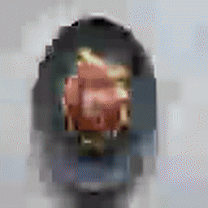
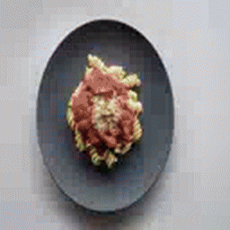
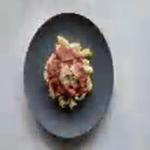
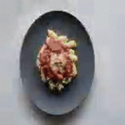
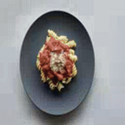

# 🧀 Top 8000 Cheese Video Generator

An automated end-to-end media pipeline that downloads, verifies, formats, and renders an epic 15+ hour countdown video featuring thousands of unique cheeses.

<p align="center">
  
</p>

---

## 📦 Quality Tiers & Previews

Compare the visual quality of each compression tier before downloading. All releases feature the complete 15.6-hour countdown.

| Tier | Size | Bitrate | Preview Sample (15s) | Direct Download |
|---|---|---|:---:|---|
| **Compact** | ~50 MB | ~7 kbps |  | [📥 Download 50MB (MP4)](https://github.com/DeveloperKubilay/8kcheese/releases/download/1.0.0/cheese-50mb.mp4) |
| **Light** | ~80 MB | ~11 kbps |  | [📥 Download 80MB (MP4)](https://github.com/DeveloperKubilay/8kcheese/releases/download/1.0.0/cheese-80mb.mp4) |
| **Standard** | ~100 MB | ~14 kbps |  | [📥 Download 100MB (MP4)](https://github.com/DeveloperKubilay/8kcheese/releases/download/1.0.0/cheese-100mb.mp4) |
| **Enhanced** | ~120 MB | ~17 kbps |  | [📥 Download 120MB (MP4)](https://github.com/DeveloperKubilay/8kcheese/releases/download/1.0.0/cheese-120mb.mp4) |
| **Master** | ~217 MB | ~32 kbps |  | [📥 Download 217MB (MP4)](https://github.com/DeveloperKubilay/8kcheese/releases/download/1.0.0/cheese-full-217mb.mp4) |

> 🏷️ All versions and release assets can also be browsed at the [1.0.0 Release Page](https://github.com/DeveloperKubilay/8kcheese/releases/tag/1.0.0).

---

## 🚀 Pipeline Architecture

The project runs in 4 sequential stages orchestrated by `run_all.py`:

```
Pexels API ──> [downloader.py] ──> photos/
                                      │
                                      ▼
                               [classifier.py] ──> verified/
                                      │
                                      ▼
                              [video_builder.py] ──> clips/ ──> output/10000_cheese.mp4
                                                                     │
                                                                     ▼
                                                          [export_qualities.py] ──> Releases
```

1. **Downloader (`downloader.py`)**: Fetches thousands of unique cheese photos concurrently using the Pexels API with automatic rate-limit backoff.
2. **Classifier (`classifier.py`)**: Validates image headers and dimensions, filtering out broken or tiny assets.
3. **Video Builder (`video_builder.py`)**: Generates blue transition count cards and produces micro-clips with smooth cross-dissolve transitions using FFmpeg.
4. **Export Qualities (`export_qualities.py`)**: Transcodes master outputs into compact (50MB), standard (100MB), and full (200MB) release artifacts.

---

## 🛠️ Getting Started

### Prerequisites
- Python 3.9+
- [FFmpeg](https://ffmpeg.org/) installed and available in your system `PATH`
- Pexels API Key ([Get a free key here](https://www.pexels.com/api/))

### Installation

1. Clone the repository:
   ```bash
   git clone https://github.com/DeveloperKubilay/8kcheese.git
   cd 8kcheese
   ```

2. Install dependencies:
   ```bash
   pip install -r requirements.txt
   ```

3. Set up your API key:
   ```bash
   cp .env.example .env
   # Edit .env and insert your PEXELS_API_KEY
   ```
   Or export it in your shell:
   ```bash
   export PEXELS_API_KEY="your_api_key_here"
   ```

---

## ⚙️ Running the Pipeline

To run the complete pipeline from scratch:
```bash
python run_all.py
```

You can skip stages if intermediate assets already exist:
```bash
python run_all.py --skip-download --skip-classify
```

To transcode release tiers and generate preview assets:
```bash
python export_qualities.py --preset all
```

---

